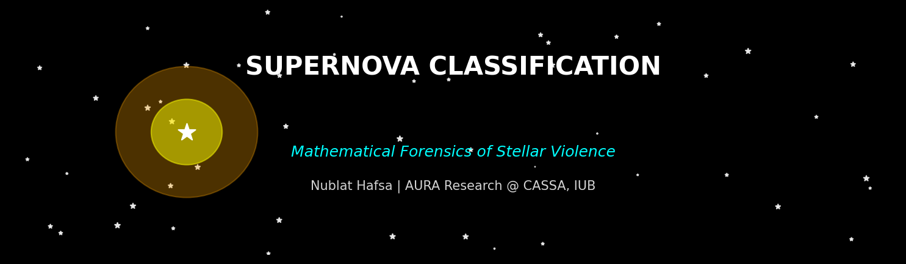

<div align="center">
  
# 🔭 Supernova Classification using Machine Learning
  
[](https://www.python.org/downloads/)
[](https://scikit-learn.org/)
[](https://opensource.org/licenses/MIT)
[](https://github.com/hafsani3hi13/supernova-light-curves-ml-classification)
[](https://github.com/hafsani3hi13/supernova-light-curves-ml-classification)

### *Mathematical Forensics of Stellar Violence*
### AURA Research Project @ CASSA, Independent University Bangladesh


</div>
# Supernova Classification using Machine Learning

**Author:** Nublat Hafsa
**Student ID:** 2411703
**Date:** 2026-02-21

## Project Overview
This pipeline classifies supernovae (Type Ia, II, Ibc) using light curve characteristics.

## Results
- Random Forest Accuracy: 98.8%
- SVM Accuracy: 96.5%

## Files
- supernova_features.csv - Dataset
- random_forest_supernova.pkl - Random Forest model
- svm_supernova.pkl - SVM model
- feature_scaler.pkl - Scaler
- supernova_forensics.png - Plot 1
- confusion_matrices.png - Plot 2

## Quick Start
```python
import joblib
import numpy as np

model = joblib.load('random_forest_supernova.pkl')
scaler = joblib.load('feature_scaler.pkl')

new_supernova = np.array([[18, 0.8, -19.3, 40, 0.2]])
normalized = scaler.transform(new_supernova)
prediction = model.predict(normalized)
print(f"Type: {prediction[0]}")
